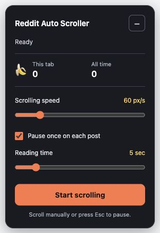

# Reddit Auto Scroller

Hands-free Reddit scrolling, with time to read each post and a banana counter along the way.



*Actual controls, captured on the local test feed.*

## What it does

- Scroll at a steady, adjustable speed from 10–300 pixels per second.
- Pause once when each post reaches the reading area, including tall posts. Choose 1–30 seconds, or turn reading pauses off.
- Keep a small control panel visible, or minimize it while leaving Start/Pause available.
- Pause when you scroll manually, interact with the page, press Escape, change pages, or hide the tab. It never starts automatically.
- Wait for more content at the bottom, then stop if the page does not move for ten seconds.
- Remember your speed, reading time, pause preference, and panel size locally in Chrome.
- Count actual scrolling distance in bananas: one banana equals 356 CSS pixels. This is a playful counter, not a physical-distance measurement.

The current Reddit feed uses `shreddit-post` elements. The extension also includes selectors for the older redesign and old.reddit.com.

## Install in Chrome

This is a source-installable extension, not a Chrome Web Store listing.

1. Download this repository using **Code → Download ZIP**, then extract it, or clone it:

   ```sh
   git clone https://github.com/BenBreaksIn/Reddit-Auto-Scroller.git
   ```

2. Open `chrome://extensions/` in Chrome and enable **Developer mode**.
3. Click **Load unpacked** and select the folder containing `manifest.json`.
4. Open or refresh a Reddit page. Click **Start scrolling** in the bottom-right panel.

To update an existing unpacked installation, replace the files or run `git pull`, click **Reload** on the extension in `chrome://extensions/`, and refresh open Reddit tabs. The new version uses Chrome's `storage` permission to save preferences and counters; the unused `activeTab` permission has been removed.

## Controls

| Control | Behavior |
| --- | --- |
| Start / Pause | Explicitly start or stop scrolling |
| Scrolling speed | Pixels per second; changes take effect immediately |
| Pause once on each post | Enable or disable reading pauses |
| Reading time | Pause length; changing speed does not restart the timer |
| − / + | Minimize or expand the panel |
| Escape | Stop scrolling |

A post gets one reading pause per feed visit. Stopping and restarting does not repeatedly pause on the same post. Moving to another Reddit page clears that reading history.

The **This tab** counter lasts until the page is reloaded. **All time** is shared across Reddit tabs in the same Chrome profile. Distance is saved periodically and when you pause; abruptly closing a tab can lose the latest unsaved fraction. The old extension's banana count is imported once from the first Reddit page opened after upgrading.

## Privacy and permissions

The extension uses only the `storage` permission and runs on Reddit's main, old, and new HTTPS hosts. It stores preferences and scrolling totals in `chrome.storage.local`, not in Reddit's page storage. There are no analytics, external requests, accounts, or remote scripts. Post positions and identifiers are used in memory to decide when to pause; post contents, URLs, and browsing history are not saved.

See Chrome's [storage API documentation](https://developer.chrome.com/docs/extensions/reference/api/storage).

## Development and checks

No build step or dependencies are needed. Use Node.js 18+ for the tests:

```sh
npm run check
npm test
```

The regression tests cover repeated-post pauses, tall posts, speed changes during pauses, duplicate-loop prevention, actual-distance counting, end-of-feed recovery, navigation resets, settings validation, concurrent storage updates, and one-time legacy-counter import.

For a local browser fixture:

```sh
python3 -m http.server 3049 --bind 127.0.0.1
```

Open `http://127.0.0.1:3049/tests/fixture.html`. Add `?layout=old` to exercise the legacy selector. The fixture loads the actual scrolling and UI scripts; Chrome's native extension storage is not available in this standalone page.

The live modern Reddit markup was inspected on October 7, 2026. All 14 automated tests pass. Reading pauses with modern and legacy post layouts, scrolling, keyboard pause, manual interaction, page changes, compact mode, and narrow-window layout have been checked in the local browser fixture. A native installed-extension check on Reddit is still pending.

| File | Responsibility |
| --- | --- |
| `core.js` | Deterministic scrolling, reading pauses, and end-of-feed lifecycle |
| `content.js` | Reddit post detection, accessible controls, and input handling |
| `background.js` | Serialized storage updates shared by Reddit tabs |
| `manifest.json` | Manifest V3 registration and scoped permissions |
